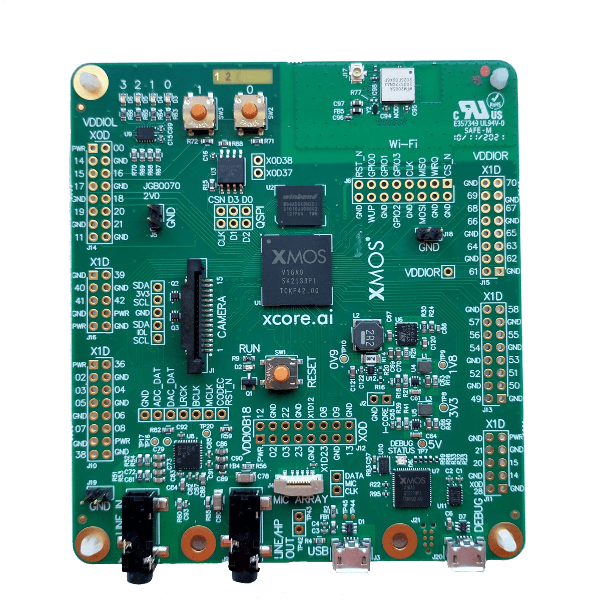

.. include:: ../../README.rst

|newpage|

Overview
--------

Introduction
............

The Universal Serial Bus (USB) is a communications architecture that gives a PC the ability to
interconnect a variety of devices. One such device is the digital still camera.

This application note gives a simple example for interfacing a USB still image capture device with
a USB host. In the example, the USB transactions implemented for image capture are compliant to the
Picture Transfer Protocol (PTP) of Photographic and Imaging Manufacturers Association (PIMA) 15470
standard.

Note, since release of the USB Still Image Class 1.0, PIMA is now known as the International Imaging
Industry Association. The PTP protocol was standardised by the ISO in 2005. The current version of
the standard is ISO 15740:2013 [#]_.

PTP is further standardized for USB by the USB Implementers Forum as the still image capture device
class. USB is the default network transport media for PTP devices. USB PTP is a common alternative
to the USB mass-storage device class (USB MSC), as a digital camera connection protocol, with some
cameras choosing to upport both modes. [#]_.

In this example an image is simulated the `xcore`, which is transferred to the host.


Block diagram
.............

.. figure:: images/block_diagram.*
   :scale: 100%
   :align: center

   Block diagram of USB still image capture device application example

.. [#] https://www.imaging.org/IST/IST/Standards/PTP_Standards.aspx?hkey=53562f0a-d9af-44f2-aa8b-f92ab989cf64

.. [#] https://www.usb.org/sites/default/files/usb_still_img10.zip


|newpage|

USB Still Image Capture Device application
------------------------------------------

The demo in this note uses the XMOS USB Device (XUD) library (``lib_xud``) and shows a simple
program for interfacing a USB still image capture device. It responds to device control and image
data transfer requests from the host PC.

For the USB Still Image Capture class application example, the system comprises three tasks running
on separate threads of a `xcore` device. The tasks perform the following operations.

   - A task containing the USB library functionality to communicate over USB

   - A task implementing Endpoint 0 responding to standard USB control requests

   - A task implementing the application code for a Still Image Capture device

These tasks communicate via the `xCONNECT` channels which allow data to be passed between
application codes running on separate threads.

The following diagram shows the task and communication structure for this USB Still Image Capture
device class application example.

.. figure:: images/task_diagram.*
   :scale: 50%
   :align: center

   Task diagram of USB still image capture device interface

The still image capture class has an interrupt endpoint as well to report the asynchronous events
occuring at the device to the host. The demo in this note however emulates the image capture device.
The interrupt endpoint is therefore not implemented although it is instantiated in Endpoint 0.
Application developers can implement this endpoint when a real image capture device is connected.


CMakeLists.txt additions for this application
.............................................

To start using the USB library, you need to add ``lib_xud`` to your `xcommon` compatible
`CMakeLists.txt`::

    set (APP_DEPENDENT_MODULES "lib_xud")

You can then access the USB functions in your source code via the ``xud_device.h`` header file::

	#include "xud_device.h"

Declaring resource and setting up the USB components
....................................................

``main.xc`` has some arrays in it that are used to configure the endpoints for the `XMOS` USB
device library. These are displayed below.

.. literalinclude:: main.xc
   :start-on: Endpoint type tables
   :end-before: USB_DATA_PKT_SIZE

The endpoint type tables inform ``lib_xud`` about the transfer types for each of the endpoints
and also if the endpoint wishes to be informed of USB bus resets.

This example has bi-directional communication with the host machine via the standard endpoint 0
and three other endpoints for implementing the Still Image Device class.

These tables are passed to the function for the USB library which is called from ``main()``.

|newpage|

The application main() function
...............................

Below is the source code for the ``main()``` function of this application, which is taken from the
source file `main.xc`

.. literalinclude:: main.xc
   :start-on: int main

Looking at this in a more detail you can see the following:

  - The par functionality describes running three separate tasks in parallel

  - There is a function call to configure and execute the USB library: ``XUD_Main()``

  - There is a function call to startup and run the Endpoint0 code: ``Endpoint0()``

  - There is a function to deal with the bulk endpoints for command and data transfer: ``bulk_endpoint()``

  - The define ``USB_TILE`` describes the tile on which the individual tasks will run

  - In this example all tasks run on the same tile, this is a requirement of ``lib_xud``

  - The `xCONNECT` communication channels used by the application are set up in the beginning of ``main()``

  - The endpoint type tables (as discussed earlier) are passed to the function ``XUD_Main()``

Configuring the USB Device ID
.............................

The USB ID values used for Vendor ID, Product ID and device version number are defined in the file
``endpoint0.xc``. These are used by the host machine to identify the device.

.. literalinclude:: endpoint0.xc
   :start-on: USB Device ID defines
   :end-on: PRODUCT_ID   0x00C1

|newpage|

USB Still Image Capture Class specific defines
..............................................

The USB Still Image Capture Class is configured in the file ``endpoint0.xc``.
Below there are a set of class-specific defines and requests which are used to configure the USB
device descriptors to setup a USB Still Image Capture Device.

.. literalinclude:: endpoint0.xc
   :start-on: USB Still Image Capture Class defines
   :end-on: STILL_IMAGE_GET_DEV_STATUS

USB Device Descriptor
.....................

``endpoint0.xc`` is where the USB device descriptor is declared the device, it is shown below.
This will be requested by the host when the device is enumerated on the USB bus.

.. literalinclude:: endpoint0.xc
   :start-on: devDesc
   :end-on: }

This descriptor contains the product, vendor and device firmware revision.

|newpage|

USB Configuration Descriptor
............................

The USB configuration descriptor is used to inform the host of the configuration the device class
and endpoint setup. It is listed below.

.. literalinclude:: endpoint0.xc
   :start-on: cfgDesc
   :end-on: }

It contains a description of the two bulk endpoints for data in and out. It also contains
the descriptors for an interrupt endpoint. The bulk endpoints are used for transferring image data
and non-image data to adjust device controls. The interrupt endpoint is used inform the host of
asynchronous event data such as battery low indication or the removal of the memory card.

USB string descriptors
......................

String descriptors provide human readable information for your device and you can configure them
with your USB product information.. The descriptors are placed in an array as shown in the below code.

.. literalinclude:: endpoint0.xc
   :start-on: String table
   :end-on: }

The `XMOS` USB library will take care of encoding the strings into Unicode and structures the
content into USB string descriptor format.

Endpoint 0
..........

The function ``Endpoint0()`` contains the code for dealing with device requests made from the host
to the standard control endpoint 0 which is present in all USB devices.
In addition to requests required for all devices, the code handles the requests specific to the
Still Image Capture Device class.

.. literalinclude:: endpoint0.xc
   :start-on: Endpoint 0 Task

USB Still Image Capture Device class requests
.............................................

``endpoint0.xc`` contains code for handling the USB Still Image Capture Device class-specific
requests. These are shown in the following code:

.. literalinclude:: endpoint0.xc
   :start-on: Still Image Class-Specific Requests
   :end-before: Endpoint 0

These class-specific requests need to be implemented by the application as they do not form part
of the standard requests which have to be accepted by all device classes via endpoint 0.

|newpage|

Handling requests to the bulk endpoints
.......................................

The application endpoints for receiving commands and transmitting data and response to the host
machine are implemented in the function ``bulk_endpoints()`` (in  ``main.xc``).

.. literalinclude:: main.xc
   :start-on: bulk_endpoint
   :end-before: case PTP_OC_GetObject:

.. literalinclude:: main.xc
   :start-on: case PTP_OC_GetObject:
   :end-before: The main

From this you can see the following.

  - Three buffers ``cmd_buf``, ``info_buf`` and ``data_buf`` are declared to communicate with the
    host for receiving commands and transferring data

  - A ``while (1)`` loop which repeatedly deals with a sequence of PTP-compliant operation requests
    from the host, send image data and response to the device. Commands are processed and an image
    is generated.

  - In each iteration, a PTP command is inspected and an appropriate response is sent

  - A gray or colour gradient image is generated for the command ``OC_GetImage``. The image type
    is defined by ``IMG_TYPE``.

  - A blocking call is made to the `XMOS` USB device library to receive a command (using
    ``XUD_GetBuffer()``). Appropriate responses are generated and sent to the host (using
    ``XUD_SetBuffer()``) to the host

  - This simple processing could easily be extended to access an image capture device connected to
    `xcore` GPIO or receive data from another parallel task.

|appendix|
|newpage|

Demo hardware setup
-------------------

To setup the demo hardware the following boards are required.

  - `XK-EVK-XU316` board
  - 2 x Micro-B USB cable



   XMOS `XK-EVK-316` Board

The hardware should be configured as follows:

  - Connect the **USB** receptacle of the `XK-EVK-XU316` to the host machine using a USB cable

  - Connect the **DEBUG** receptacle `XK-EVK-XU316` to the host machine using a USB cable

The use of `xSCOPE` is required in this application so that the print messages that are generated on
the device as part of the demo do not interfere with the real-time behavior of the USB device.

|newpage|

Host application setup
----------------------

Test application
................

This simple host example demonstrates simple PTP transactions between a host and an `xcore` device
in bulk transfer mode.

The application sends commands for receiving the image size and the type and then sends a request
to get the image. It receives a response for each command and also the image data. The received
image data is stored in a file and displayed.

The application was tested on a 64-bit Linux platform. The binary and 'libusb' library for this
platform along with the source files of the application are provided in the ``host`` directory.
For other platforms, please refer to the application note `AN00136: Example USB Vendor Specific
Device` [#]_.

Licensing
.........

``libusb`` is written in C and licensed under the LGPL-2.1.


Compilation instructions
........................

If you require to recompile the test program then the instruction to do so is below:

Linux64::

  g++ -o get_image ../get_image.cpp -I ../libusb/Linux64 ../libusb/Linux64/libusb-1.0.a -lpthread -lrt


Building the application
------------------------

The application uses the `xcommon-cmake <https://www.xmos.com/file/xcommon-cmake-documentation/?version=latest>`_
build system as bundled with the XTC tools.

To configure the build run the following from an XTC command prompt::

    cd AN00132_image_class
    cmake -G "Unix Makefiles" -B build

If any dependencies are missing it is at this configure step that they will be downloaded by the build system.

Finally, the application binary can be built using ``xmake``::

    xmake -C build

This command will cause a binary (.xe file) to be generated in the `bin` directory,

Launching the demo application
------------------------------

Once the demo example has been built the application can be executed on the `XK-EVK-XU316`.

Once built there will be a ``bin`` directory within the project which contains the binary for the
`xcore` device. The `xcore` binary has a `XMOS` standard .xe extension.

Launching from the command line
...............................

From the command line the ``xrun`` tool is used to download code to the `xcore` device. Changing
into the bin directory of the project the code can be executed on the `xcore` as follows::

    xrun app_image_class.xe

Once this command has executed the device should have enumerated on the host machine.

Running the host demo
.....................

To run the example, navigate to 'host/Linux64' and execute './get_image' from the command line.

This will connect to the example device and transfer data buffers back and forth.

The demo prompts the user for the inputs - image size and type. The output of the demo is as below::

  XMOS USB image device opened .....
  Session opened ....
  Image captured ....
  Image info got ....
  Image written to PNM and JPG files .....
  Displaying image .....
  Session closed ....
  XMOS USB image device closed .....

|newpage|

The gradient image received by the host is first saved in PNM [#]_ format and then converted to a
JPG file. The image is displayed. PNM is portable anymap format that was designed to be easily
exchanged between platforms. It can be one of these: portable pixmap format (PPM), portable graymap
format (PGM) and portable bitmap format (PBM).
Sample output gray image files ``image.pnm`` and ``image.jpg`` are in the ``host/Linux64`` directory.
The generated color and gray images are shown in Figures 4 and 5.

.. figure:: images/color_image.*

	Color image

.. figure:: images/gray_image.*

	Gray image


.. [#] https://www.xmos.com/file/an00136
.. [#] http://en.wikipedia.org/wiki/Netpbm_format

|newpage|

References
----------

.. nopoints::

  * `XMOS` XTC Tools Installation Guide

    https://xmos.com/xtc-install-guide

  * `XMOS` XTC Tools User Guide

    https://www.xmos.com/view/Tools-15-Documentation

  * USB 2.0 Specification

    https://www.usb.org/sites/default/files/usb_20_20240604.zip

  * `XMOS` application build and dependency management system; `xcommon-cmake`

    https://www.xmos.com/file/xcommon-cmake-documentation/?version=latest

  * USB Still Image Capture device class specification

    https://www.usb.org/sites/default/files/usb_still_img10.zip

  * Picture Transfer Protocol (PTP)

    https://www.imaging.org/IST/IST/Standards/PTP_Standards.aspx?hkey=53562f0a-d9af-44f2-aa8b-f92ab989cf64

  * ``libusb`` library

    http://www.libusb.info

|newpage|

Full source code listing
------------------------

Source code for endpoint0.xc
............................

.. literalinclude:: endpoint0.xc
  :largelisting:

|newpage|

Source code for main.xc
.......................

.. literalinclude:: main.xc
  :largelisting:

|newpage|

