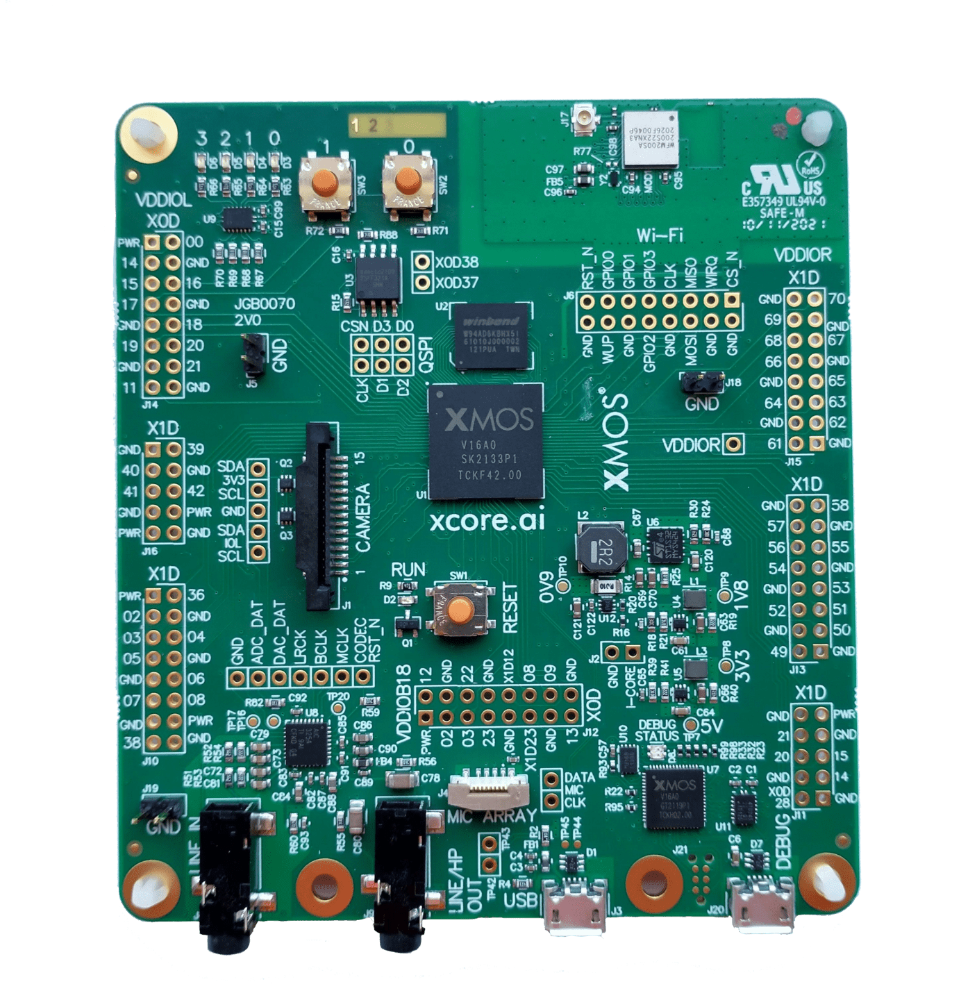

.. include:: ../../README.rst

|newpage|

Overview
--------

Introduction
............

The USB Test and Measurement class (USBTMC) specification allows the test and measurement devices
with a USB interface so that messages can be exchanged between the host and devices.

The subclass specification communicates to the devices based on IEEE 488.1 (GPIB) and IEEE 488.2
(Standard Commands for Programmable Instruments - SCPI) standards.

These types of devices enumerate as Test and Measurement class USB devices on the host. A USBTMC
device must be able to support the control endpoint, Bulk-OUT and Bulk-IN endpoints. The
Interrupt-IN endpoint is optional and is used by the device to send notifications to the Host.

Examples of test and measurement devices includes

  - ADCs, DACs, Sensors, DAQs

  - Digital instrument cards, IEE-488 based communication devices

Each USBTMC device implements its own command set based on USBTMC subclass (IEEE488) standards.
Host can use any VISA compliant application to send these commands to the device and read the
response from the device.

Block diagram
.............

.. figure:: images/block_diagram.*
   :scale: 100%
   :align: center

   Block diagram of USBTMC device application example

USB Test and Measurement Class Device application
-------------------------------------------------

The application in this note uses the XMOS USB device library and creates a USBTMC device which
responds to IVI-VISA compliant host application messages.
The device implements basic message requests for Bulk IN and Bulk OUT endpoints.
Interrupt IN endpoint is optional and is not used in this application.
The application integrates an open source SCPI parser library and implements a minimal subset of
SCPI commands to communicate with host. More SCPI commands can be easily added to this application
by following the steps detailed in the ``Using SCPI library to add more SCPI commands`` appendix
section.

For the USBTMC device class application example, the system comprises three tasks running on
separate threads of an `xcore` device.

The tasks perform the following operations.

   - A task containing the USB library functionality to communicate over USB

   - A task implementing Endpoint 0 responding to standard USB control requests

   - A task implementing the USBTMC class specific message handling application code for both Bulk
     IN and Bulk OUT endpoints

These tasks communicate via the use of `xCONNECT` channels which allow data to be passed between
application code running on the separate logical cores.

The following diagram shows the task and communication structure for this USBTMC application example.

.. figure:: images/task_diagram.*

        Task diagram of USBTMC device

CMakeLists.txt additions for this application
.............................................

To start using the USB library, you need to add ``lib_xud`` to your `xcommon` compatible
`CMakeLists.txt`::

    set (APP_DEPENDENT_MODULES "lib_xud")

You can then access the USB functions in your source code via the ``xud_device.h`` header file::

	#include "xud_device.h"

Setting up the USB library
..........................

``main.xc`` has some arrays in it that are used to configure the endpoints for the the `XMOS` USB
device library. These are displayed below.

.. literalinclude:: main.xc
   :start-on: USB Endpoint Defines
   :end-on: Prototype

The tables above describe the endpoint configurations for this device.
This example has bi-directional communication with the host machine via the standard endpoint 0
and endpoints for implementing the bulk-in and bulk-out endpoints.

These tables are passed to the function for the USB library which is called from ``main()``.

The application main() function
...............................

Below is the source code for the ``main()`` function of this application, which is taken from
the source file ``main.xc``

.. literalinclude:: main.xc
   :start-on: int main

Looking at this in a more detail you can see the following:

  - The ``par`` functionality describes running three separate tasks in parallel

  - There is a function call to configure and execute the USB library: ``XUD_Main()``

  - There is a function call to start up and run the Endpoint0 code: ``Endpoint0()``

  - There is a function to deal with the USBTMC device bulk endpoints ``usbtmc_bulk_endpoints()``

  - The define ``USB_TILE`` describes the tile on which the individual tasks will run

  - In this example all tasks run on the same tile, this is only a requirement of ``XUD_Main()``

  - The `xCONNECT` communication channels used by the application are set up at the beginning of ``main()``

  - The endpoint type tables discussed earlier are passed into the function ``XUD_Main()``.

Configuring the USB Device ID
.............................

The USB ID values used for Vendor ID, Product ID and device version number are defined in the file
``endpoint0.xc``. These are used by the host machine to identify the device.

.. literalinclude:: endpoint0.xc
   :start-on: BCD_DEVICE
   :end-on: PRODUCT_STR_INDEX

USBTMC Class specific defines
.............................

The USBTMC class is configured in the file ``endpoint0.xc``.
Below there are a set of standard defines which are used to configure the
USB device descriptors to setup a USBTMC device.

.. literalinclude:: endpoint0.xc
   :start-on: VENDOR_SPECIFIC_CLASS
   :end-on: VENDOR_SPECIFIC_PROTOCOL

USB Device Descriptor
.....................

``endpoint0.xc`` is where the USB device descriptor is declared the device, it is shown below.
This will be requested by the host when the device is enumerated on the USB bus.

.. literalinclude:: endpoint0.xc
   :start-on: devDesc
   :end-on: }

This descriptor contains the product, vendor and device firmware revision.

USB Configuration Descriptor
............................

The USB configuration descriptor is used to inform the host of the configuration the device class
and endpoint setup. It is listed below.

.. literalinclude:: endpoint0.xc
   :start-on: cfgDesc
   :end-on: }

It contains a description of the two bulk endpoints which form our USBTMC device.

Note that `bInterfaceProtocol` value is controlled by the define `USBTMC_SUB_CLASS_SUPPORT` and it
is set to ``0`` implying that no subclass specification applies and the USBTMC interface is not
required to have an Interrupt IN endpoint.

USB string descriptors
......................

String descriptors provide human readable information for your device and you can configure them
with your USB product information.. The descriptors are placed in an array as shown in the code
below.

.. literalinclude:: endpoint0.xc
   :start-on: String table
   :end-on: }

The `XMOS` USB library will take care of encoding the strings into Unicode and structure the
content into USB string descriptor format.

The last value corresponds to the `iSerialNumber` of the device, which should contain a non-zero
value such that the host can produce a globally unique identifier. In a production environment
a system for generating and storing unique serial numbers should be employed.

USBTMC Endpoint 0
.................

The function ``Endpoint0()`` contains the code for dealing with device requests made from the host
to the standard control endpoint 0 which is present in all USB devices.

.. literalinclude:: endpoint0.xc
   :start-on: Endpoint 0 Task
   :end-on: } //if(result == XUD_RES_OKAY)

The control interface class requests are handled using the function below.

.. literalinclude:: endpoint0.xc
   :start-on: XUD_Result_t ControlInterfaceClassRequests
   :end-on: return XUD_RES_ERR;

The application implements the ``GET_CAPABILITIES`` request and uses it to send the device capabilities
to the host.

|newpage|

Handling requests to the USBTMC bulk endpoints
..............................................

The application endpoints for receiving and transmitting to the host machine are implemented in
the file ``usbtmc_endpoints.xc``. Implementation is in the function ``usbtmc_bulk_endpoints()``
which is shown below:

.. literalinclude:: usbtmc_endpoints.xc
   :start-on: usbtmc_bulk_endpoints(
   :end-on: case XUD_SetData_Select

From this you can see the following.

  - A buffer is declared to communicate and transfer data with the host ``host_transfer_buf`` of
    size `BUFFER_SIZE`.

  - Bulk-OUT endpoint is set as ready to receive the data from the host

  - SCPI parser library is initialized using ``SCPI_initialize_parser`` wrapper API call

  - This task operates inside a ``while(1)`` loop which has a select handler to repeatedly deal
    with events related to bulk endpoints

  - The select event handler gets the data from bulk out endpoint, decodes the USBTMC device
    dependent command messages using SCPI command parser

  - The function ``SCPI_parse_cmd`` parses the USBTMC device dependent command message, prepares
    a response message and sends the response using the bulk IN endpoint using ``XUD_SetReady_In()``

  - The Bulk OUT endpoint is set as ready once again to receive the data from the host

  - Any vendor specific command requests and responses could also be handled in a similar manner

|appendix|
|newpage|

Demo hardware setup
-------------------

To setup the demo hardware the following boards are required.

  - `XK-EVK-XU316` board
  - 2 x Micro-B USB cable

   XMOS `XK-EVK-316` Board

The hardware should be configured as follows:

  - Connect the **USB** receptacle of the `XK-EVK-XU316` to the host machine using a USB cable

  - Connect the **DEBUG** receptacle `XK-EVK-XU316` to the host machine using a USB cable

The use of `xSCOPE` is required in this application so that the print messages that are generated on
the device as part of the demo do not interfere with the real-time behavior of the USB device.

|newpage|

Building the application
------------------------

The application uses the `xcommon-cmake <https://www.xmos.com/file/xcommon-cmake-documentation/?version=latest>`_
build system as bundled with the XTC tools.

To configure the build run the following from an XTC command prompt::

    cd AN00135_test_and_measurement_class
    cmake -G "Unix Makefiles" -B build

If any dependencies are missing it is at this configure step that they will be downloaded by the build system.

Finally, the application binary can be built using ``xmake``::

    xmake -C build

This command will cause a binary (.xe file) to be generated in the `bin` directory,

Launching the demo application
------------------------------

Once the demo example has been built the application can be executed on the `XK-EVK-XU316`.

Once built there will be a ``bin`` directory within the project which contains the binary for the
`xcore` device. The `xcore` binary has a `XMOS` standard .xe extension.

Launching from the command line
...............................

From the command line the ``xrun`` tool is used to download code to the `xcore` device. Changing
into the bin directory of the project the code can be executed on the `xcore` as follows::

    xrun app_test_and_measurement.xe

Once this command has executed the device should have enumerated on the host machine.

Running the USBTMC demo
.......................

* Ensure the USBTMC device enumeration on a Linux (Ubuntu 12.04 LTS) host has occurred::

	xmos@xmos:~$ lsusb
	Bus 001 Device 001: ID 1d6b:0002 Linux Foundation 2.0 root hub
	Bus 001 Device 012: ID 20b1:2337 XMOS Ltd

* List the details of the device descriptor::

	root@xmos-lenovo:/home/xmos# lsusb -v
	> lsusb -v
	Bus 001 Device 012: ID 20b1:2337 XMOS Ltd
	Device Descriptor:
	  bLength                18
	  bDescriptorType         1
	  bcdUSB               2.00
	  bDeviceClass            0 (Defined at Interface level)
	  .
	  .
	  idVendor           0x20b1 XMOS Ltd
	  idProduct          0x2337
	  bcdDevice            1.26
	  iManufacturer           1 XMOS
	  iProduct                2 XMOS TestMeasuement device
	  .
	  .
	Interface Descriptor:
	  .
	  .
	  bInterfaceClass       254 Application Specific Interface
	  bInterfaceSubClass      3 Test and Measurement
	  bInterfaceProtocol      0
	  iInterface              3 USBTMC
	  Endpoint Descriptor:
	  .
	  .
	  bEndpointAddress     0x01  EP 1 OUT
	  bmAttributes            2
	    Transfer Type            Bulk
	  .
	  .
        bEndpointAddress     0x81  EP 1 IN
        bmAttributes            2
            Transfer Type            Bulk
	  .
	  .

|newpage|

* Open a `Terminal` window (using root privileges) and communicate with the XMOS USBTMC device::

	root@xmos-lenovo:/home/xmos# python
	Python 2.7.3 (default, Aug  1 2012, 05:16:07)
	[GCC 4.6.3] on linux2
	Type "help", "copyright", "credits" or "license" for more information.
	>>> import usb.core
	>>> import usb.util
	>>>
	>>> dev = usb.core.find(idVendor=0x20b1, idProduct=0x2337)
	>>> import usbtmc
	>>> instr =  usbtmc.Instrument(0x20b1, 0x2337)

* Identify the USBTMC device using IDN query::

	>>>
	>>> print(instr.ask("*IDN?"))
	XMOS, USBTMC, 1, 01-01

	>>>
	>>> print(instr.ask("*RST"))
	SCPI command not implemented
	>>>

* Query the DC voltage of the device using the SCPI command as follows::

	>>> print(instr.ask("*MEASure:VOLTage:DC?"))
	10

Note: The DC voltage measurement function is stubbed inside the device code to return a sample
voltage value. This logic can be replaced with instrument data such as actual ADC results.

Using NI LabVIEW to communicate with XMOS USBTMC device
-------------------------------------------------------

NI LabVIEW software can communicate with USBTMC devices using VISA functions (Read, Write, Open, Close) in the same way as you would communicate with GPIB instruments. You can create a simple block diagram as below.

.. figure:: images/ni_labview_block_diagram.*

        NI LabVIEW block diagram to communicate to XMOS USBTMC device

This example opens a VISA session, uses a SCPI command to query the ID of the device and the response is read back before closing the session. To test this block, connect your device to a host and ensure it successfully enumerates as USBTMC device as follows.

.. figure:: images/win_device_list.*

        XMOS device enumerated as USBTMC device on a Windows 7 host

|newpage|

Navigate to the NI LabVIEW front panel window of the block diagram and select XMOS USBTMC device in the VISA IO resource listing.

.. figure:: images/ni-front-panel.*

   NI LabVIEW front panel to select XMOS USBTMC device

Click `Run` button (Right arrow). The device id of the manufacturer, which is `XMOS USBTMC device with version number` in this case is populated in the results buffer as follows.

.. figure:: images/ni_labview_results.*

   NI LabVIEW front panel displaying results from XMOS USBTMC device

Similarly you can alter the query from the block diagram to contain a different SCPI command (for e.g., ``*MEASure:VOLTage:DC?``), submit it to your device and record the new results.

Using SCPI library to add more SCPI commands
--------------------------------------------

The application supports very minimum SCPI commands on the device. Adding more SCPI commands is a simple configuration because the device code ports an Open source SCPI library. In order to add more SCPI commands, follow the below steps.

 #. Navigate to ``src\scpi_parser\custom\scpi_parser_config.c`` file
 #. Add SCPI command to the ``scpi_commands`` structure and attach a callback function
 #. Declare the callback function in ``src\scpi_parser\custom\scpi_cmds.h`` file
 #. Source file ``src\scpi_parser\custom\scpi_cmds.c`` contains the definition of callback functions. These functions interface with device measurement logic in order to capture the instrument results. Define the callback function logic for the configured SCPI command in this file.
 #. When the USBTMC host client software uses the corresponding SCPI command, this callback function is invoked and the computed result is sent back to the host as response message using the existing framework.

|newpage|

References
----------

.. nopoints::

  * `XMOS` XTC Tools Installation Guide

    https://xmos.com/xtc-install-guide

  * `XMOS` XTC Tools User Guide

    https://www.xmos.com/view/Tools-15-Documentation

  * USB 2.0 Specification

    https://www.usb.org/sites/default/files/usb_20_20240604.zip

  * `XMOS` application build and dependency management system; `xcommon-cmake`

    https://www.xmos.com/file/xcommon-cmake-documentation/?version=latest

  * USB 2.0 Specification

    http://www.usb.org/developers/docs/usb20_docs/usb_20_081114.zip

  * USB Test and Measurement Class Specification (USBTMC)

    https://www.usb.org/document-library/test-measurement-class-specification

  * Open Source SCPI device library

    https://github.com/j123b567/scpi-parser

|newpage|

Full source code listing
------------------------

Source code for endpoint0.xc
............................

.. literalinclude:: endpoint0.xc
  :largelisting:

Source code for usbtmc_endpoints.xc
...................................

.. literalinclude:: usbtmc_endpoints.xc
  :largelisting:

Source code for main.xc
.......................

.. literalinclude:: main.xc
  :largelisting:

|newpage|

